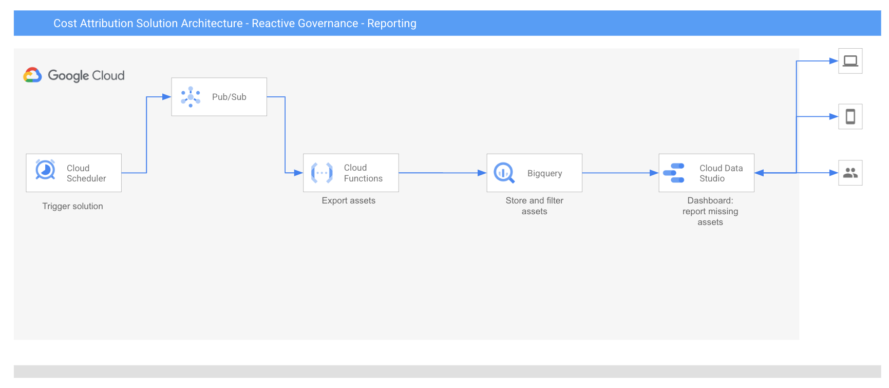
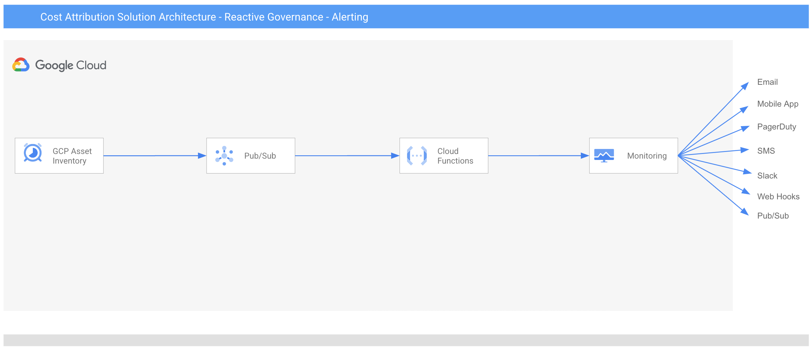
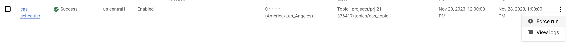
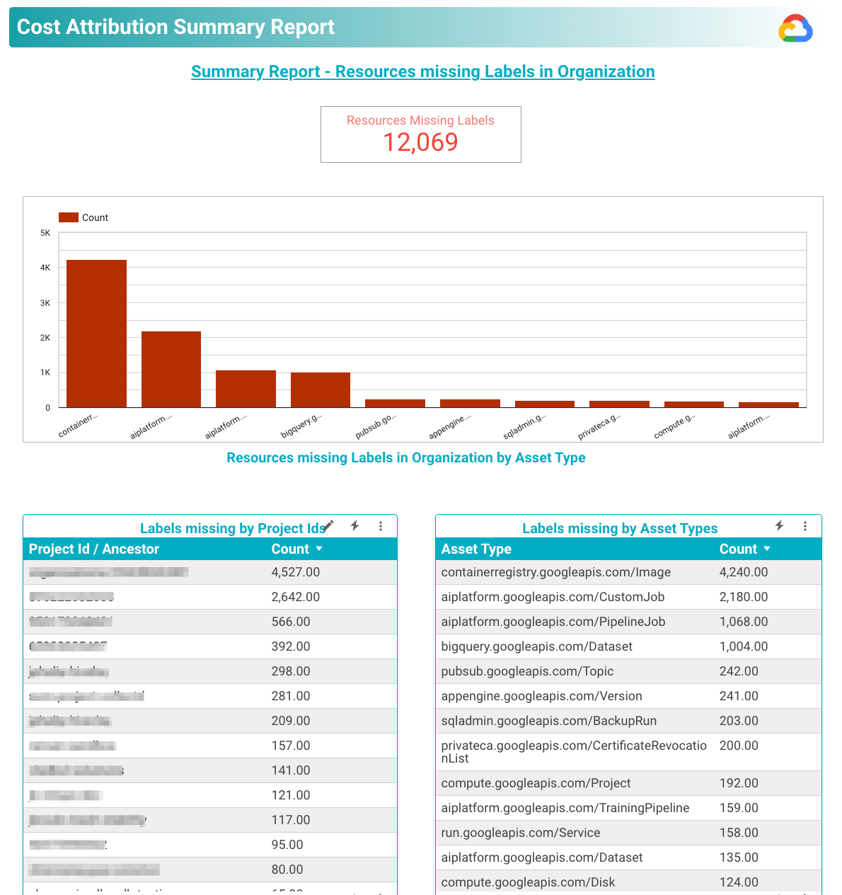

# Reactive Governance - Reporting and Alerting
If your enterprise is in the phase of running workloads on GCP and there are resources that are missing labels, 
use reactive governance. As a best practice, it is recommended to use reactive governance along with 
[proactive governance](https://github.com/google/cost-attribution-solution/tree/main/proactive-governance) 
 to ensure all resources are labeled appropriately. To implement reactive governance, frequently 
scan the platform for constraint violations on labels and send notifications when a violation is found.

There are 3 parts of the reactive governance solution:
* **Reporting** resources with missing labels.
* **Alerting** when resource is created or updated without labels.
* **Label Automation** efficiently and accurately applies labels to projects, streamlining workflows and reducing errors.

## Reporting Architecture 


The architecture is built using Google Cloud managed services - Cloud Scheduler,
Functions, Pub/Sub, BigQuery and Looker studio.

*   The solution is architected to scale using Pub/Sub.
*   Cloud Scheduler is used to trigger Cloud Functions. This is also an user
    interface to configure frequency, parent nodes etc.
*   Cloud Function is used to export list of organization assets into BigQuery table.
*   BigQuery is used to store data and create view with resources that do not have labels.
*   Easy to get started and deploy with Looker Studio Dashboard. In addition to
    Looker Studio, other visualization tools can be configured.
*   The Looker Studio report can be scheduled to be emailed to appropriate team
    for weekly/daily reporting.

## Alerting Architecture


The architecture is built using Google Cloud managed services - Asset Feed,
Functions, Pub/Sub and Cloud Monitoring.

*   Asset Feeds are subscribed using Pub/Sub. 
*   Cloud Function is used to filter and log asset feed.
*   Log metric is configured to trigger an alert for asset feed. 

### 1. Prerequisites

1.  Host Project - A project where the BigQuery instance, Cloud Functions and
    Cloud Schedulers will be deployed. For example Project A.
2.  Target Node - The Organization or folder or project which will be scanned
    for Assets. For example Org A or Folder A.
3.  Project Owner role on host Project A. 
4.  Google Cloud SDK is installed. Detailed instructions to install the SDK
    [here](https://cloud.google.com/sdk/docs/install#mac). See the Getting Started
    page for an introduction to using gcloud and terraform.
5.  Terraform version >= 0.14.6 installed. Instructions to install terraform here
    *   Verify terraform version after installing.

    ```sh
    terraform -version
    ```

    The output should look like:

    ```sh
    Terraform v0.14.6
    + provider registry.terraform.io/hashicorp/google v3.57.0
    ```

    *Note - Minimum required version v0.14.6. Lower terraform versions may not work.*

## 2. Initial Setup

1.  In local workstation or  create a new directory to run terraform and store
    credential file

    ```sh
    mkdir <directory name>
    cd <directory name>
    ```

2.  Set default project in config to host project A

    ```sh
    gcloud config set project <HOST_PROJECT_ID>
    ```

    The output should look like:

    ```sh
    Updated property [core/project].
    ```

3.  Ensure that the latest version of all installed components is installed on
    the local workstation.

    ```sh
    gcloud components update
    ```

4.  Cloud Scheduler depends on the App Engine application. Create an App Engine
    application in the host project. Replace the region. List of regions where
    App Engine is available can be found
    [here](https://cloud.google.com/about/locations#region).

    ```sh
    gcloud app create --region=<region>
    ```

    Note: Cloud Scheduler (below) needs to be in the same region as App Engine.
    Use the same region in terraform as mentioned here.

    The output should look like:

    ```sh
    You are creating an app for project [quota-monitoring-project-3].
    WARNING: Creating an App Engine application for a project is irreversible and the region
    cannot be changed. More information about regions is at
    <https://cloud.google.com/appengine/docs/locations>.

    Creating App Engine application in project [quota-monitoring-project-1] and region [us-east1]....done.

    Success! The app is now created. Please use `gcloud app deploy` to deploy your first app.
    ```

## 3. Create Service Account

1.  In local workstation, setup environment variables. Replace the name of the
    Service Account in the commands below

    ```sh
    export DEFAULT_PROJECT_ID=$(gcloud config get-value core/project 2> /dev/null)
    export SERVICE_ACCOUNT_ID="sa-"$DEFAULT_PROJECT_ID
    export DISPLAY_NAME="sa-"$DEFAULT_PROJECT_ID
    ```

2.  Verify host project Id.

    ```sh
    echo $DEFAULT_PROJECT_ID
    ```

3.  Create Service Account

    ```sh
    gcloud iam service-accounts create $SERVICE_ACCOUNT_ID --description="Service Account to deploy cost attribution solution and export assets" --display-name=$DISPLAY_NAME
    ```

    The output should look like:

    ```sh
    Created service account [sa-cost-attribution-solution-1].
    ```

## 4. Grant Roles to Service Account

### 4.1 Grant Roles in the Host Project

The following roles need to be added to the Service Account in the host
project i.e. Project A:

*   BigQuery
    *   BigQuery Admin
*   Cloud Functions
    *   Cloud Functions Admin
*   Cloud Scheduler
    *   Cloud Scheduler Admin
*   Pub/Sub
    *   Pub/Sub Admin
*   Run Terraform
    *   Service Account User
    *   Service Usage Admin
*   Monitoring
    *  Notification Channel Editor
    *  Alert Policy Editor
    *  Viewer
    *  Metric Writer
*   Logs
    *  Logs Configuration Writer
    *  Log Writer
*   Cloud Asset
    * Cloud Asset Owner

1.  Run following commands to assign the roles:

    ```sh
    export SA_ROLES="roles/bigquery.admin \
    roles/cloudfunctions.admin \
    roles/cloudscheduler.admin \
    roles/pubsub.admin \
    roles/iam.serviceAccountUser \
    roles/serviceusage.serviceUsageAdmin \
    roles/monitoring.notificationChannelEditor \
    roles/monitoring.alertPolicyEditor \
    roles/logging.configWriter \
    roles/logging.logWriter \
    roles/monitoring.viewer \
    roles/monitoring.metricWriter \
    roles/cloudasset.owner \
    roles/storage.admin"

    for role in $SA_ROLES; do
    echo "Assigning role: $role"
    gcloud projects add-iam-policy-binding $DEFAULT_PROJECT_ID \
        --member="serviceAccount:$SERVICE_ACCOUNT_ID@$DEFAULT_PROJECT_ID.iam.gserviceaccount.com" \
        --role $role --condition=None
    done
    ```

### 4.2 Grant Roles in the Target Organization

If you want to scan projects in the org, add following roles to the Service
Account created in the previous step at the Org A:

*   Reporting
    *   Cloud Asset Viewer 
*   Alerting
    *   Cloud Asset Owner - This permission allows solution to subscribe to asset feed. This solution does not 
    modify assets at the org level

1.  Set target organization id

    ```sh
    export TARGET_ORG_ID=<target org id ex. 38659477579>
    ```

2.  Run the following commands to add to the roles to the service account
* Reporting:
    ```sh
    gcloud organizations add-iam-policy-binding  $TARGET_ORG_ID --member="serviceAccount:$SERVICE_ACCOUNT_ID@$DEFAULT_PROJECT_ID.iam.gserviceaccount.com" --role="roles/cloudasset.viewer" --condition=None
    ```
* Alerting:
    ```sh 
    gcloud organizations add-iam-policy-binding  $TARGET_ORG_ID --member="serviceAccount:$SERVICE_ACCOUNT_ID@$DEFAULT_PROJECT_ID.iam.gserviceaccount.com" --role="roles/cloudasset.owner" --condition=None
    ```

### 4.3 Download the Source Code

1.  Clone the Cost attribute Solution repo

    ```sh
    git clone https://github.com/google/cost-attribution-solution.git cost-attribution-solution
    ```

2.  Change directories into the Terraform example

    ```sh
    cd cost-attribution-solution/reactive-governance/sample-deployment
    ```

### 4.4 Set OAuth Token Using Service Account Impersonization

Impersonate your host project service account and set environment variable
using temporary token to authenticate terraform. You will need to make
sure your user has the
[Service Account Token Creator role](https://cloud.google.com/iam/docs/service-account-permissions#token-creator-role)
to create short-lived credentials.

```sh
gcloud config set auth/impersonate_service_account \
    $SERVICE_ACCOUNT_ID@$DEFAULT_PROJECT_ID.iam.gserviceaccount.com

export GOOGLE_OAUTH_ACCESS_TOKEN=$(gcloud auth print-access-token)
```

*   **TIP**: If you get an error saying *unable to impersonate*, you will
    need to unset the impersonation. Have the role added similar to below, then
    try again.

    ```sh
    # unset impersonation
    gcloud config unset auth/impersonate_service_account

    # set your current authenticated user as var
    PROJECT_USER=$(gcloud config get-value core/account)

    # grant IAM role serviceAccountTokenCreator
    gcloud iam service-accounts add-iam-policy-binding $SERVICE_ACCOUNT_ID@$DEFAULT_PROJECT_ID.iam.gserviceaccount.com \
        --member user:$PROJECT_USER \
        --role roles/iam.serviceAccountTokenCreator \
        --condition=None
    ```
    
## 5. Configure Terraform

1.  Verify that you have these 3 files in your local directory:
    *   main.tf
    *   variables.tf
    *   terraform.tfvars.example

2.  Open [terraform.tfvars](terraform/modules/cas-reactive/terraform.tfvars) file in your
    favourite editor and change values for the variables.

    ```sh
    cp terraform.tfvars.example terraform.tfvars
    vi terraform.tfvars
    ```

3. For `region`, use the same region as used for App Engine in earlier steps.

## 6. Run Terraform

1.  Run terraform commands
    *   `terraform init`
    *   `terraform plan`
    *   `terraform apply`
        *   On Prompt Enter a value: `yes`

2.  This will:
    *   Enable required APIs
    *   Create all resources and connect them.

    Note: In case terraform fails, run terraform plan and terraform apply again

3.  Stop impersonating service account (when finished with terraform)

    ```sh
    gcloud config unset auth/impersonate_service_account
    ```

## 7. Test Reporting

1.  Initiate first job run in Cloud Scheduler.

    **Console**

    Click 'Force Run' on Cloud Job scheduler.

    *Note: The status of the ‘Run Now’ button changes to ‘Running’ for a fraction
    of seconds.*

    

    **Terminal**

    ```sh
    gcloud scheduler jobs run cas-scheduler --location <region>
    ```

2.  To verify that the program ran successfully, check the BigQuery Table. The
    time to load data in BigQuery might take a few minutes. The execution time
    depends on the number of projects to scan. 


## 8. Reporting Dashboard 
Any visualization tool that works with BigQuery can be used. For this setup, Looker Studio has been used.

### 8.1 Looker Studio Dashboard Setup

1.  Go to the [Looker Studio dashboard template](https://lookerstudio.google.com/s/l2haE0mW5cc).
    A Looker Studio dashboard will look like this:
    
2.  Make a copy of the template from the copy icon at the top bar (top - right
    corner)
3.  Click on ‘Copy Report’ button **without changing datasource options**
4.  This will create a copy of the report and open in Edit mode. If not click on
‘Edit’ button on top right corner in copied template
5.  Select any one table. On the
    right panel in ‘Data’ tab, click on icon ‘edit data source’
    It will open the data source details
6.  Replace the BigQuery with view created by the solutions.
7.  After making sure that query is returning results, replace it in the Data
    Studio, click on the ‘Reconnect’ button in the data source pane.
8.  In the next window, click on the ‘Done’ button.
9.  Once the data source is configured, click on the ‘View’ button on the top
    right corner.
    
Note: make additional changes in the layout like which metrics to be displayed
    on Dashboard, color shades for consumption column, number of rows for each
    table etc in the ‘Edit’ mode.

### 8.1 Scheduled Reporting

Cost Attribution reports can be scheduled from the Looker Studio dashboard using
‘Schedule email delivery’. The screenshot of the Looker Studio dashboard will be
delivered as a pdf report to the configured email Ids.

## 9. Test Alerting 
Make sure email id is provided in the terraform.tfvars file during terraform setup in the
earlier steps. By default, following services are configured to receive alerts:
* Compute Instance
* Cloud Storage Bucket
* Bigquery Dataset
* Bigquery Table
* PubSub Topic
* PubSub Subscription 

For additional resources, add services in the main.tf file under "project_feed".

For testing, add a compute instance and do not add label, you should receive alerts via email. 
Also, if a compute instance which had label, remove label and save. You should receive 
an alert via email. 

## 10. Label Automation (Reconciliation)

Go beyond just reporting and alerting by actively enforcing your labeling policies on 
existing projects. This empowers you to automate the application of correct labels to 
unlabeled or mislabeled resources, for comprehensive cost visibility and data accuracy 
across your entire Google Cloud landscape. Streamline your labeling workflow with
[these steps](https://github.com/google/cost-attribution-solution/tree/main/reactive-governance/label-automation/project_label_automation/) for automated labeling. 

