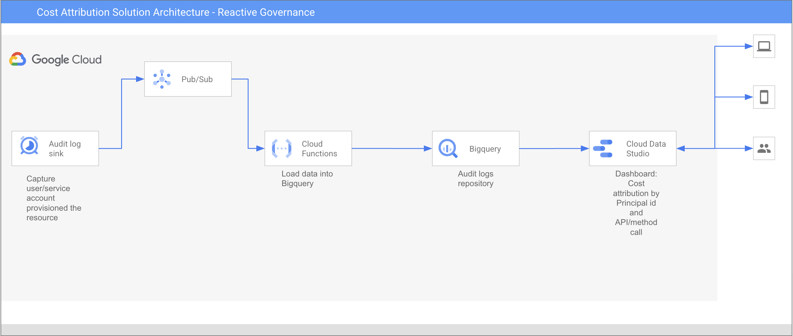

# Cost Attribution for Vertex AI Workloads via Audit Logs
This document outlines a solution for obtaining detailed cost analytics for Vertex AI workloads. The methodology involves the implementation of an automated data pipeline to capture, process, and archive Vertex AI audit logs within BigQuery. This process facilitates the attribution of expenditures directly to specific users and API calls, thereby providing granular financial insights.

# Architectural Overview
The proposed architecture establishes a serverless data pipeline designed to stream audit logs directly into BigQuery, which enables comprehensive analysis. This solution captures and processes Vertex AI audit logs, storing them in BigQuery to enable detailed cost attribution and analysis. By tracking resource usage through audit logs, you can gain insights into which specific users or services are driving your Vertex AI costs.


# Prerequisites
Prior to implementation, the following prerequisites must be satisfied:

**Google Cloud Project** A designated project is required to host the solution's resources.

**Permissions** The user or service account executing the deployment must possess the Owner role on the host project.

**Google Cloud SDK** The gcloud command-line tool must be installed and authenticated.

**Terraform** Version v0.14.6 or a subsequent version is required.

# Deployment Instructions
The subsequent steps provide a comprehensive guide for deploying the requisite infrastructure utilizing Terraform.

# Step 1: Environment Preparation
The initial phase involves cloning the repository, configuring the designated Google Cloud project, and activating all necessary services.

## 1. Clone the Source Repository and Navigate to Directory
```sh
git clone https://github.com/google/cost-attribution-solution.git
cd cost-attribution-solution/reactive-governance/audit-logs-attribution
```
## 2. Set Up Google Cloud Environment

Define the Project ID as an environment variable
```sh
export PROJECT_ID="<YOUR_PROJECT_ID>"
```
Configure the gcloud CLI to target the specified project
```sh
gcloud config set project $PROJECT_ID
```
Ensure all gcloud components are updated to the latest version
```sh
gcloud components update
```
Enable all required APIs for the solution's operation
```sh
gcloud services enable \
    iam.googleapis.com \
    cloudbuild.googleapis.com \
    run.googleapis.com \
    cloudfunctions.googleapis.com \
    logging.googleapis.com \
    bigquery.googleapis.com \
    pubsub.googleapis.com \
    storage.googleapis.com \
    eventarc.googleapis.com \
    cloudresourcemanager.googleapis.com \
    --project=$PROJECT_ID
```
# Step 2: Service Account and Permission Setup
This phase creates the dedicated service accounts and assigns all the necessary permissions required by Terraform to deploy the solution.

## 1. Create the Deployment Service Account
This account will be used by Terraform to provision all the resources.

Set environment variables for the service account
```sh
export DEPLOYMENT_SA_ID="sa-vertex-attribution"
export DEPLOYMENT_SA_EMAIL="$DEPLOYMENT_SA_ID@$PROJECT_ID.iam.gserviceaccount.com"
```
Create the service account
```sh
gcloud iam service-accounts create $DEPLOYMENT_SA_ID \
    --display-name="Terraform Vertex Attribution SA" \
    --project=$PROJECT_ID
```
## 2. Grant Permissions to the Deployment Service Account
This account requires a broad set of permissions to manage the various services in the solution.

Define the list of roles
```sh
export SA_ROLES="roles/bigquery.admin roles/cloudfunctions.admin roles/cloudscheduler.admin roles/pubsub.admin roles/iam.serviceAccountUser roles/iam.serviceAccountAdmin roles/iam.serviceAccountCreator roles/resourcemanager.projectIamAdmin roles/serviceusage.serviceUsageAdmin roles/logging.configWriter roles/storage.admin"
```
Apply the roles in a loop
```sh
for role in $SA_ROLES; do
  echo "Assigning $role to $DEPLOYMENT_SA_EMAIL"
  gcloud projects add-iam-policy-binding $PROJECT_ID \
      --member="serviceAccount:$DEPLOYMENT_SA_EMAIL" \
      --role=$role \
      --condition=None
done
```
## 3. Grant Permissions to Google-Managed Service Accounts
This critical step grants necessary permissions to Google's own service accounts, which are used in the background for processes like Cloud Build.

Get the project number
```sh
export PROJECT_NUMBER=$(gcloud projects describe $PROJECT_ID --format="value(projectNumber)")
```
Define the Google-managed service accounts
```sh
export CLOUD_BUILD_SA="serviceAccount:$PROJECT_NUMBER@cloudbuild.gserviceaccount.com"
export COMPUTE_SA="serviceAccount:$PROJECT_NUMBER-compute@developer.gserviceaccount.com"
```
Grant roles to the Cloud Build SA for deploying the function
```sh
gcloud projects add-iam-policy-binding $PROJECT_ID --member=$CLOUD_BUILD_SA --role="roles/run.admin"
gcloud projects add-iam-policy-binding $PROJECT_ID --member=$CLOUD_BUILD_SA --role="roles/cloudfunctions.developer"
```
Grant roles to the Compute Engine default SA for build process tasks
```sh
gcloud projects add-iam-policy-binding $PROJECT_ID --member=$COMPUTE_SA --role="roles/logging.logWriter"
gcloud projects add-iam-policy-binding $PROJECT_ID --member=$COMPUTE_SA --role="roles/storage.objectViewer"
gcloud projects add-iam-policy-binding $PROJECT_ID --member=$COMPUTE_SA --role="roles/artifactregistry.reader"
gcloud projects add-iam-policy-binding $PROJECT_ID --member=$COMPUTE_SA --role="roles/artifactregistry.writer"
```
## 4. Grant Your User Permission to Impersonate
Your user account needs the ability to act as the deployment service account.
```sh
export PROJECT_USER=$(gcloud config get-value core/account)
gcloud iam service-accounts add-iam-policy-binding $DEPLOYMENT_SA_EMAIL \
    --member="user:$PROJECT_USER" \
    --role="roles/iam.serviceAccountTokenCreator"
```
# Step 3: Terraform Variable Configuration
This step involves defining the configuration parameters for the solution.

## 1. Create a Variables File
A local configuration file should be created by copying the provided example.
```
cp terraform.tfvars.example terraform.tfvars
```
## 2. Define Configuration in terraform.tfvars
The terraform.tfvars file must be populated with values corresponding to the target environment.

Example terraform.tfvars
```sh
project_id    = "your-gcp-project-id"
region        = "us-central1"
bq_region     = "US"
bq_dataset_id = "vertex_ai_audit_logs"
bq_table_id   = "audit_events_raw"
bucket_name   = "your-unique-bucket-name"
cf_name       = "process-vertex-audit-logs"
```
# Step 4: Infrastructure Deployment
Execution of the standard Terraform workflow is required to provision the specified Google Cloud resources.

## 1. Set Impersonation and Generate Token
Wait 60-90 seconds after granting permissions in Step 2 before running these commands to allow IAM changes to propagate.
```sh
gcloud config set auth/impersonate_service_account $DEPLOYMENT_SA_EMAIL
export GOOGLE_OAUTH_ACCESS_TOKEN=$(gcloud auth print-access-token)
```
## 2. Initialize, Plan, and Apply

Initialize the working directory
```sh
terraform init
```
Create an execution plan
```sh
terraform plan
```
Apply the configuration (Type 'yes' when prompted)
```sh
terraform apply
```
## 3. Stop Impersonating
After the deployment is finished, return to your user account.
```sh
gcloud config unset auth/impersonate_service_account
```
# Clean Up
To avoid incurring ongoing charges, you can destroy the resources created by this solution.

## 1. Set Impersonation
```sh
gcloud config set auth/impersonate_service_account $DEPLOYMENT_SA_EMAIL
export GOOGLE_OAUTH_ACCESS_TOKEN=$(gcloud auth print-access-token)
```
## 2. Destroy the Resources
```sh
terraform destroy
```
(Type yes when prompted)

## 3. Stop Impersonating
```sh
gcloud config unset auth/impersonate_service_account
```
## 4. Delete the Service Account (Optional)
```sh
gcloud iam service-accounts delete $DEPLOYMENT_SA_EMAIL --project=$PROJECT_ID
```


