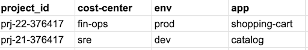
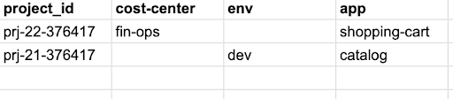
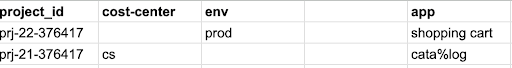
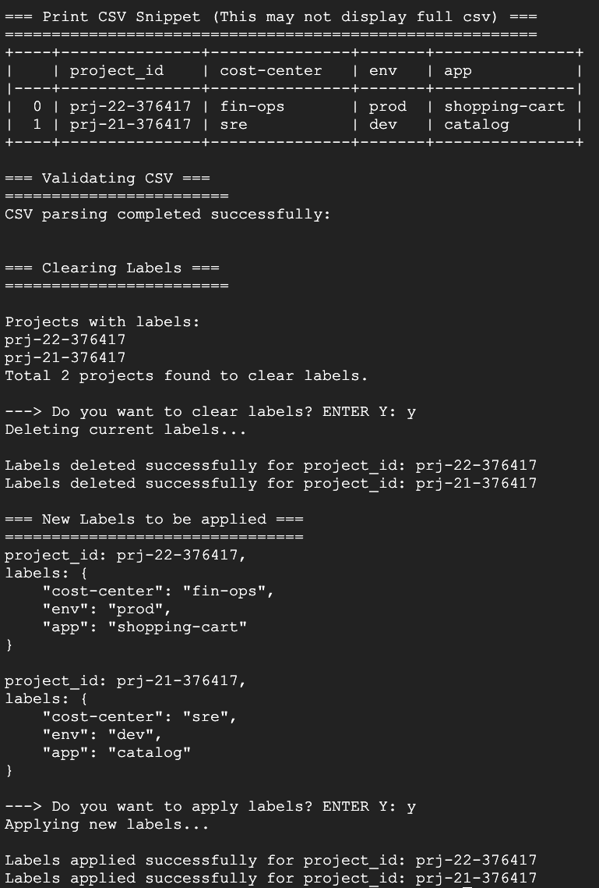

# Label Automation
Go beyond just reporting and alerting by actively enforcing your labeling policies on
existing projects. This empowers you to automate the application of correct labels to
unlabeled or mislabeled resources, for comprehensive cost visibility and data accuracy
across your entire Google Cloud landscape.

This Python-based CLI tool provides a solution for clearing and applying labels to Google Cloud projects.

## Features

* **Automated Label Management:** Efficiently clears existing labels and applies new ones to specified projects.
* **GCS Integration:** Reads label data from a CSV file stored in Google Cloud Storage (GCS).
* **Manual Intervention:** Includes a confirmation step before any changes are made, allowing for review and preventing accidental modifications.
* **Error Handling:** Error handling for empty columns or invalid key-value pairs in the input CSV.
* **Secure Execution:** Designed to run on a Compute Engine instance with SSH access, eliminating the need to download Service Account keys locally.

## Prerequisites

* **Python 3.7 or higher:** Ensure you have a compatible Python version installed.
* **Google Cloud Project:** An active GCP project with the necessary APIs enabled (e.g., Cloud Resource Manager).
* **Terraform:**  Terraform installed and configured to interact with your GCP project.

## Getting Started

**1. Prepare Label Data:**

* **Create a CSV file:** Create a CSV file containing the project IDs and the new label key-value pairs you want to apply.
* **CSV File Structure:** Ensure your CSV adheres to the following structure:
  ```
  project_id,cost-center,environment,app
  my-project-123,fin-ops,prod,shopping-cart
  my-project-456,sre,dev,catalog
  ```
  * The **first column** must contain the `project_id`.
  * **Subsequent column headers** represent the `label keys` (e.g., "cost-center", "environment", "app").
  * The **cells** in each row represent the corresponding `label values` for each project.
    Example of a valid CSVs:

    
    
    
    Example of a CSV with errors in values:

    

    In this example, the following errors are present:
    * `shopping cart`: Contains a space.
    * `cata%log`: Contains a special character (`%`).
    
* **Upload to GCS:** Upload the CSV file to a GCS bucket.

**1. Setup:**

* **Terraform Variables:**
  * In the cloned repo, move to the current directory and update terraform variables as per your setup:
 
      cd terraform
      vi variables.tf

**3. Provision Infrastructure:**
    
    terraform init
    terraform plan
    terraform apply
 This will create the Compute Engine VM and Service Account with the required permissions.

**4. Execute the Script:**

* **SSH into the VM:**  Connect to the newly created VM instance using SSH.
* Download `automate_project_labels.py` and `requirements.txt` on the VM
* **Prepare the environment:**
   ```bash
   sudo apt-get install python3-venv 
   python3 -m venv env
   source env/bin/activate
   pip install -r requirements.txt 
   ```
* **Run the script:**
  * The script will prompt you to enter the full GCS path to your CSV file (e.g., `gs://your-bucket-name/labels.csv`).
   ```bash
   python3 automate_project_labels.py
   ```


**5. Sample CLI Output:**

